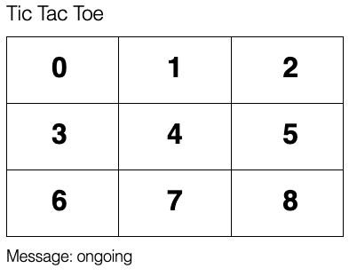
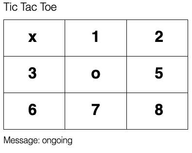
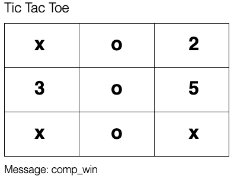

# TicTacToe

Unwinnable single player TicTacToe game implemented using Phoenix LiveView with state managed by a GenServer and computer moves calculated with a minimax algorithm.

* Phoenix
  * LiveView
* Elixir
  * GenServer
* minimax algorithm

Start game: 

----
First round: 

----
Comp wins: 

----

## Setup

Clone this repo:
```bash
git clone https://github.com/fnxctrl/Elixir_Phoenix-LiveView_TicTacToe.git \
&& cd Elixir_Phoenix-LiveView_TicTacToe/
```

To start your Phoenix server:

Install dependencies
```bash
mix deps.get && cd assets && npm install && cd ..
```
Start Phoenix endpoint with `mix phx.server`

TicTacToe game available on [localhost:4000](http://127.0.0.1:4000)


## Attributions

* https://github.com/phoenixframework/phoenix_live_view
* https://github.com/RobStallion/minimax_tic_tac_toe
